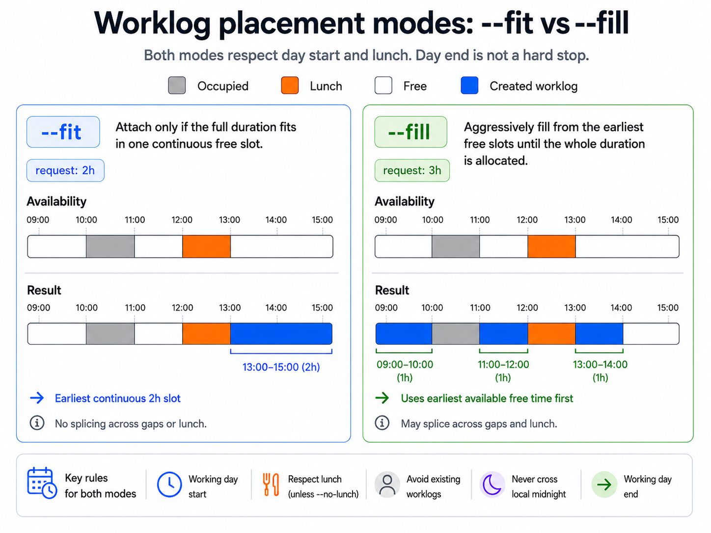
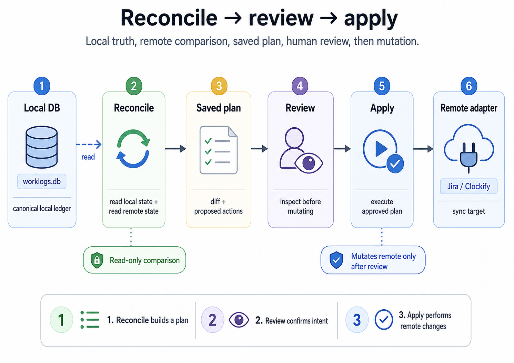

# workledger

`workledger` is a local-first CLI for keeping canonical worklogs in SQLite and reconciling them with remote time trackers through reviewed plans.

It is built for operators and coding agents that need one inspectable source of truth for work done, gaps, corrections, totals, and sync decisions.

## Core contract

- YAML stores operator-managed configuration at `~/.config/workledger/config.yaml`.
- SQLite stores canonical local worklogs at `~/.local/share/workledger/worklogs.db` by default.
- Remote adapters such as Jira and Clockify provide evidence, comparison data, and sync targets; they are not the source of truth.
- Reconciliation is plan-based: inspect, save, review, then apply.
- Human output defaults to `table`; automation should use `--output json`.
- Adapter secrets are referenced by environment variable names. Inline secrets are invalid.

The canonical product contract lives in:

- [`specs/functional.md`](specs/functional.md)
- [`specs/non-functional.md`](specs/non-functional.md)

When this README and the specs disagree, the specs win.

## Install

```sh
brew install solitus0/tap/workledger
```

For local development:

```sh
go run ./cmd/workledger --help
```

## First run

```sh
workledger init
workledger status
```

`init` creates the config file when needed and provisions local SQLite storage. `status` runs setup diagnostics and shows authenticated identity details for successful remote checks.

## Daily workflow

Add work locally at an explicit time:

```sh
workledger worklogs add --issue PROJ-123 --started todayT09:00 --duration 2h --description "Implement reconciliation flow"
```

Let `workledger` place one entry in the earliest free slot:

```sh
workledger worklogs add --issue PROJ-123 --fit --today --duration 2h --description "Implement reconciliation flow"
workledger worklogs add --issue PROJ-123 --fit --mon --duration 90m --description "Review pull request"
```

Fill a selected date window, splitting across free slots when needed:

```sh
workledger worklogs add --issue PROJ-123 --fill --from 2026-05-14 --to 2026-05-14 --duration 5h --description "Implement reconciliation flow"
workledger worklogs add --issue PROJ-123 --fill --tue --duration 3h --description "Prepare release notes"
```

### `--fit` vs `--fill`



`--started` accepts local timestamps such as `2026-05-14T09:00`, `todayT09:00`, `yesterdayT09:00`, `tomorrowT09:00`, `+2dT09:00`, and `-3dT09:00`.

Inspect the current local day:

```sh
workledger worklogs context --today
```

Compare local time with a configured adapter:

```sh
workledger totals --instance clockify --today
```

Create and execute a remote sync plan:

```sh
workledger plan reconcile --today
workledger plan show <plan-id>
workledger plan apply <plan-id>
```

### Reconcile -> review -> apply



`plan reconcile` is non-destructive. It saves the execution contract; `plan apply` performs the mutation after review.

## Date selectors

Use one date selector per command unless the command accepts an explicit `--from` and `--to` range.

| Selector | Meaning |
| --- | --- |
| `--today` | Current local day. |
| `--yesterday` | Previous local day. |
| `--mon` through `--sun` | One day in the current local Monday-through-Sunday week. |
| `--current-week` | Current local Monday-through-Sunday week. |
| `--last-week` | Previous local Monday-through-Sunday week. |
| `--current-month` | Current local calendar month. |
| `--last-month` | Previous local calendar month. |
| `--from <date> --to <date>` | Explicit inclusive local date range. |
| `--week-offset <n>` | Shift one weekday selector by whole weeks; valid only with `--mon` through `--sun`. |

`--from` and `--to` accept `YYYY-MM-DD`, `today`, `yesterday`, `tomorrow`, and signed day offsets such as `+2d` or `-3d`.

## Recommended agent workflow

If you use an agent with `workledger`, install the `workledger-onboarding` skill for guided first-time setup and `status` diagnostics before any worklog entry or remote sync workflow.

```sh
npx skills add solitus0/workledger --skill workledger-onboarding -g
```

Install the `session-worklog-creator` skill to turn current coding-session context into local worklogs with minimal prompting.

```sh
npx skills add solitus0/workledger --skill session-worklog-creator -g
```

If you use Codex and want it to write local worklogs to the shared SQLite database outside the current agent session without asking for permission on every add, allow the default storage path in your Codex sandbox config:

```toml
[sandbox_workspace_write]
writable_roots = [
  "~/.local/share/workledger"
]
```

## Configuration

Run setup commands to add adapters to the local YAML config:

```sh
workledger setup jira-cloud
workledger setup jira-data-center
workledger setup clockify
```

Each setup command can prompt interactively or accept flags. Use command help for exact inputs:

```sh
workledger setup clockify --help
```

## Output and failure model

- stdout is reserved for command output.
- stderr is used for logs, diagnostics, and progress.
- `--output json` writes valid JSON to stdout without mixed logs.
- Exit code `0` means success.
- Exit code `1` means unexpected failure.
- Exit code `2` means validation or input failure.
- Exit code `3` means not found.
- Exit code `4` means authentication failure.
- Exit code `5` means external or connectivity failure.
- Exit code `6` means partial success.

## Contributing

Start with the specs before changing behavior. Keep implementation, tests, and documentation aligned with the current contract in the same change.

Use standard Go checks:

```sh
go test ./...
```

Business logic belongs outside Cobra command handlers. Keep CLI rendering, exit-code mapping, storage, adapter work, and domain behavior separated.
